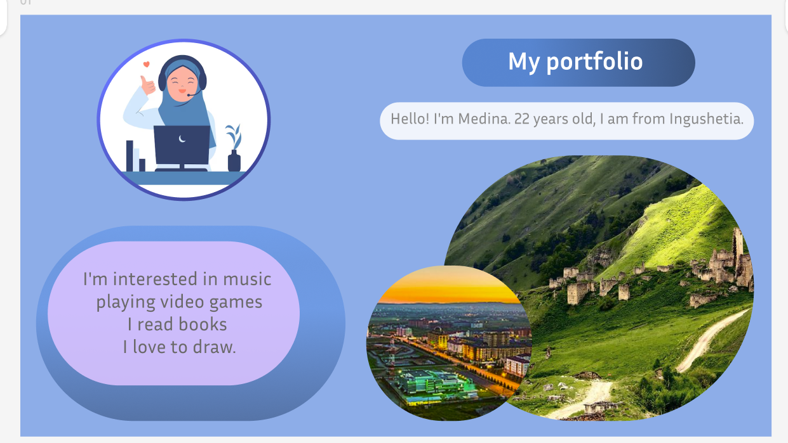
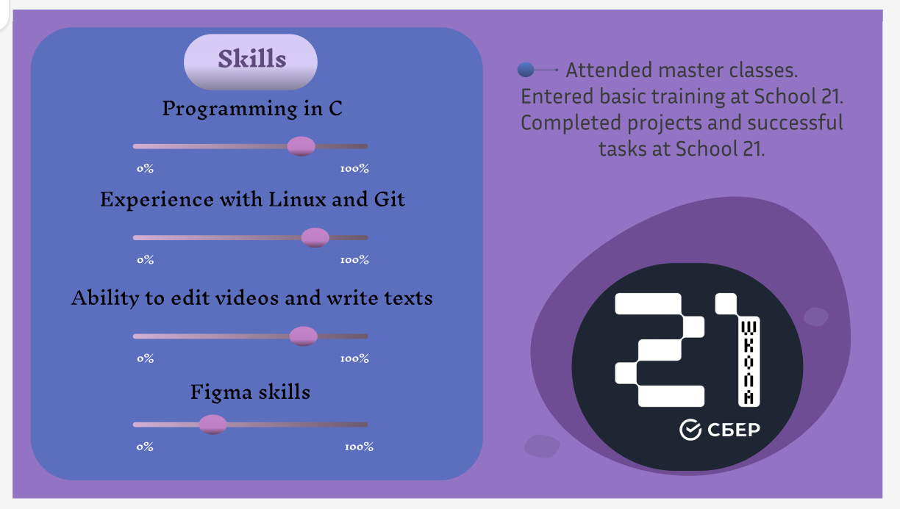
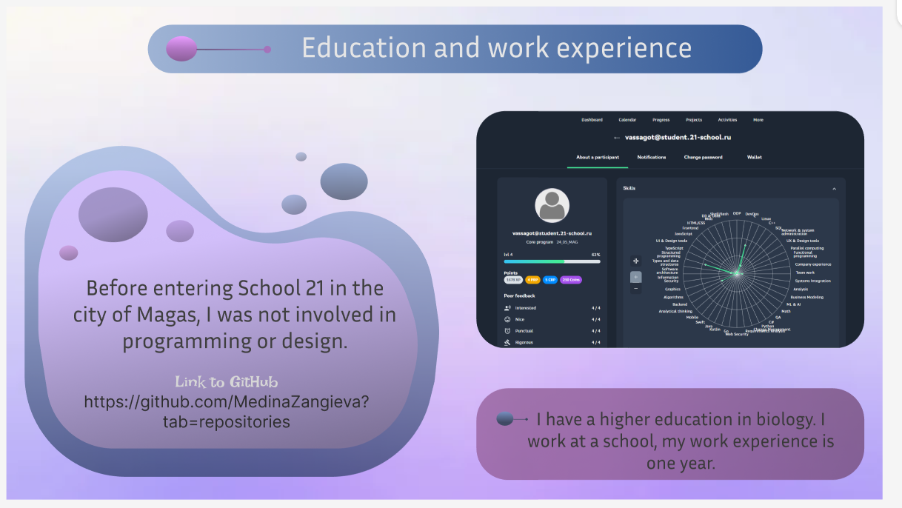

# My Portfolio

 <!-- Изображение вашего портфолио из Figma -->

## Приветствие

**Привет! Меня зовут Медина. Мне 22 года, я из Ингушетии.**

## Обо мне

Я интересуюсь:

- Музыкой
- Видеоиграми
- Чтением книг
- Рисованием

## Контакты

- [GitHub](https://github.com/MedinaZangieva) <!-- Замените "#" на ссылку на ваш GitHub профиль -->
- [Email](medizam123123@gmail.com) <!-- Замените на ваш реальный email -->

## Галерея

 <!-- Второе изображение, если оно существует -->
 <!-- Третье изображение, если оно существует -->

## Используемые технологии

- **Figma**: для создания макета и дизайна
- **HTML & CSS**: для разработки статических страниц
- **JavaScript**: для интерактивности и динамических элементов

## Лицензия

Этот проект распространяется под лицензией MIT. Подробности см. в [LICENSE](LICENSE).
